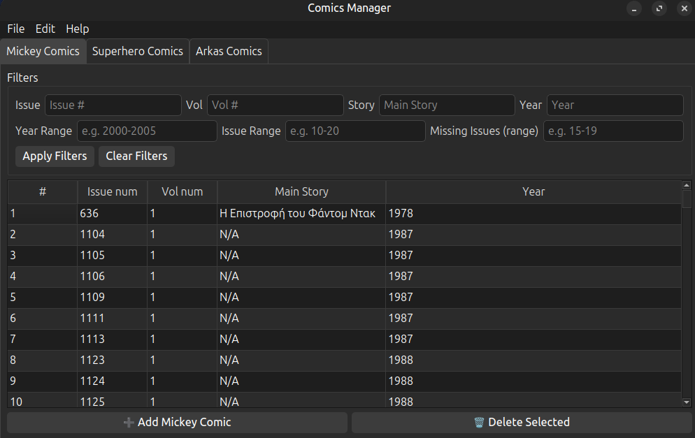
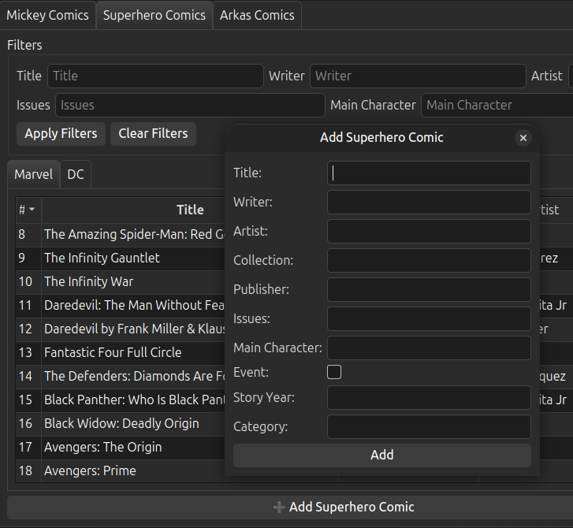
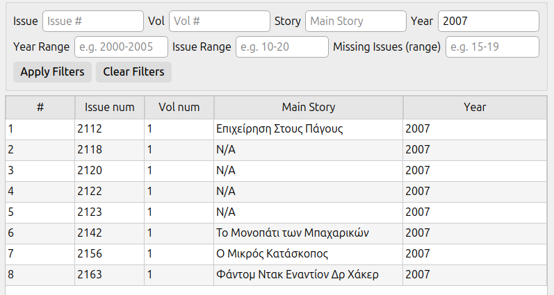
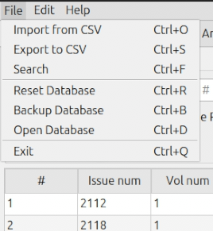

# Comic Analitics

## About 

A destop app build with **python** and **pyside6 (qt)** for managing comic book collections

## Features 

- *Multiple tabs based on database tables*
- *Search filters*
- *Add/Delete/Edit tuples*
- *CSV import*
- *CSV export*
- *Database backup/deletion*
- *Dark/Light theme support*
- *Manual querry execution*

## Technologies used
- **Python 3.12 :** Programming Languege
- **PySide6 :** GUI framework
- **SQLite3 :** Embedded databse
- **Pytest :** Testing framework
- **PyInstaller :** Packaging to executable

## Src Stracture

1. *src/database/ :* Database + Database manipulation functions
2. *src/services/ :* Services for csv's and filters
3. *src/ui/ :* User interface
4. *tests/ :* Unit tests


## Installation instructions 

### Clone repository
```bash
git clone https://github.com/Miltos-Chalaidopoulos/ComicAnalitics.git

cd ComicAnalytics
```
### Create virtual Enviroment
```bash
python3 -m venv .venv
```
```bash
source .venv/bin/activate # for linux

# or for Windows
Set-ExecutionPolicy -Scope Process -ExecutionPolicy Bypass
.venv\Scripts\activate
```
### Install dependancies
``` bash
pip install -r requirements.txt
```
### Run the application
``` bash
python -m src.main
```
## Build executable instructions
```bash
cd src
#for linux
pyinstaller --onefile --noconfirm --distpath ../dist --workpath ../build --name ComicAnalytics main.py
# for Windows
pyinstaller --onefile --noconfirm --windowed --name ComicAnalytics --distpath dist --workpath build --paths src src\main.py
```
executable file is located in /dist with name ComicAnalytics
## Application 
Some screenshots from the Comic Analitics app
### Main Screen

### Manual Comic Addition

### Filer result

### File options

